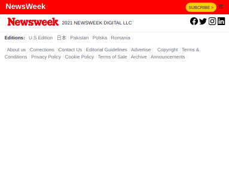
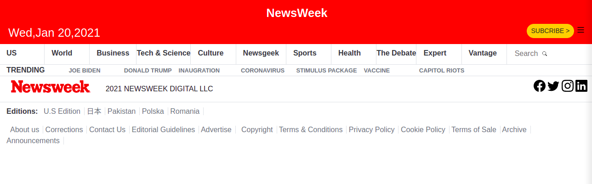

# Newsweeks clone

Newsweeks clone that provide most news that you need to know in the easiest way .

The next project is to check out more about Responsive design using bootstrap and how to apply mobile-first techniques, this website was created using bootstrap and good practices. We've included bootstrap and good practices to build, with responsive design, a simple website clone of newsweek.com

Screenshots :
Phone Version :

Tablet Version :

Desktop Version :

## Built With 🔨

- HTML5
- Bootstrap
- Visual Studio Code
- Git & Github

## Live Demo 👀

[Live Demo Link](https://fortuneonyeka.github.io/bootstrap-newsweek/)

### Install

To get a local copy up and running follow these simple example steps.
- Open terminal
- Clone this project by command git clone https://github.com/fortuneonyeka/bootstrap-newsweek.git
- Cd news-week folder
- Open index.html in browser

## Getting Started 
- Index.html is the main marke up that will show as the first page in the browser .
- In css folder you will find the css file that contain all applicated designing on this project .
- Img folder contain most of pictures that has been in use for this project

### Prerequisites

- IDE to edit and run the code (We've used Visual Studio Code 🔥).

### Usage

- For anyone who wants to practice HTML5 and Bootstrap responsive design.
- How to apply responsive desing using Bootstrap and good practices.

## Author

👤 **Ihedoro Fortunatus Onyeka**

- GitHub:[@hfortuneonyeka](https://github.com/fortuneonyeka)
- Twitter: [@fortuneonyeka](https://twitter.com/FortuneOnyeka)
- LinkedIn: [Fortunatus Ihedoro](https://www.linkedin.com/in/fortunatus-ihedoro-5a43711a3/)

## Author

👤 **Juan Marcos Mérida**

- GitHub: [@Juan Marcos Mérida ](https://github.com/marcosmerida)
- Twitter:
- LinkedIn: [Juan Marcos Mérida ](https://www.linkedin.com/in/marcos-merida-219437206/ )

## 🤝 Contributing

Contributions, issues, and feature requests are welcome!

Feel free to check the [issues page]().

## Show your support

Give a ⭐️ if you like this project!

## Acknowledgments

- Inspiration
- Microverse program 
- My standup team 

## License
This project is [MIT](./mit.md) licensed.
